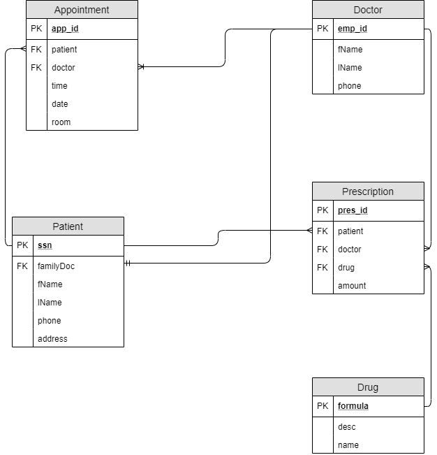

# HospitalManagementSystem

#### Software Requirements Specification			
#### Version 1.0.
#### Jacob LeBlanc
	

## 1.0. Introduction
The purpose of this document is to build an online system to manage patients, doctors, appointments and prescriptions to ease hospital management.

### 1.1. Document Conventions
DB - Database

ER - Entity Relationship

### 1.2. Intended Audience
This project is useful for patients, doctors and the management team of the hospital. 

### 1.3. Intended Use
This project is intended to be used in hospitals to improve the current management systems.

### 1.4. Project Scope
The purpose of the hospital management system is to ease the tracking of patient records and appointments by creating an easy-to-use application. The system is based on a relational database.

### 1.5. References
https://krazytech.com/projects/sample-software-requirements-specificationsrs-report-airline-database
https://www.perforce.com/blog/alm/how-write-software-requirements-specification-srs-document

## 2.0. Overall Description
The following is an overview of the new hospital management system.

### 2.1. Product Perspective
The hospital management system stores the following information.

Patient records: This includes their first and last name, social security number, phone number and address. A patient will also have a family doctor. 

Doctor information: A doctor has a fist and last name along with a specialty. They must have a work phone number, and their identified by their unique employee id. 
	
Drug: A drug is identified by their unique formula, is given a name and description of the drugs intended uses. 

Prescription: A doctor can give a patient a prescription. Each prescription has a doctor, patient and a drug. A prescription is identified by a prescription id, and holds the amount of drugs to give patient.

### 2.2. Product Features

### 2.3. User Class and Characteristics
This system will support three types of user privileges, patients (customers), doctors and the management of the hospital (managers, etc.). The patients will only have access to patient functions. Doctors will only have access to doctor and customer functions.  Management will have access to both patient, doctor and management functions. Patient functions should do the following functions: 

- Make an appointment
- Cancel an appointment
- View scheduled appointments
- Change their own patient information

Doctor functions are as follows:
- Change their own doctor information
- Add a new prescription

The management should have the following functionalities: 
- Add new doctor
- Add new patient
- Add new drug

### 2.4. Operating Environment
The operating environment for the new hospital management system is as listed below. 
- client/server system
- Operating System: Windows
- Database: mySQL database
- Platform: Spring application/Java

## 3.0. System Features and Requirements
The following is a description of the features for the new hospital management system.

### 3.1. Description and Priority
The hospital management system maintains information on patients, doctors, appointments, drugs and prescriptions. This project is of high priority as it is difficult to manage a hospital without a consistent and efficient way to maintain all this information.

### 3.2. Functional Requirements
- Maintain appointments (Add/Delete/Edit)
- Print schedule of appointments
- Maintain patient records (Add/Delete/Edit)
- Maintain doctor records (Add/Delete/Edit)
- Maintain drug information (Add/Delete/Edit)
- Maintain prescriptions (Add/Delete/Edit)

### 3.3. External Interface Requirements
- Front-end software: Spring
- Back-end software: mySQL
- Operating system: Windows
- A browser which supports HTML

### 3.4. Nonfunctional Requirements
  #### 3.4.1. Performance Requirements
  - ER Model
  - Normalization of a database

  #### 3.4.2. Safety Requirements
  In the case of failure, a recovery system will restore a past copy of the database to restore as much as possible.

  #### 3.4.3. Security Requirements
  The new hospital management system must protect the information of patients and doctors. This information must only be accessed by users can special permissions and privileges. 
		

			
			
